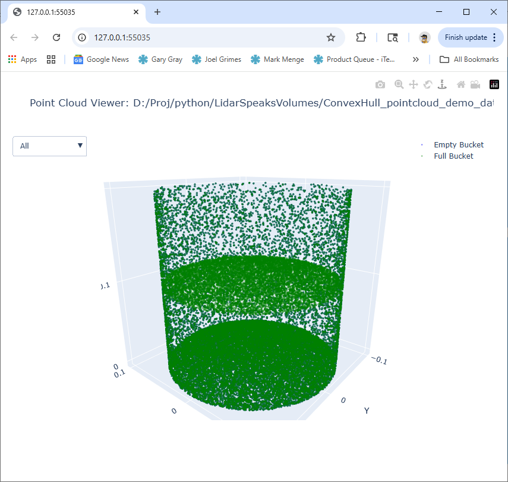

# Bucket LiDAR Simulation with ConvexHull Volume Estimation

## Goal
Simulate LiDAR-style point cloud data for a cylindrical bucket, estimate its fill volume using a fast **ConvexHull ("tent")** method, and visualize it in 3D.

---

## Components

### 1. bucket_volume_pointcloud_demo.py
Generates the point cloud and computes bucket + fill volumes.

**Key features**
- Randomized cylindrical geometry for bucket walls, bottom, and material fill surface.
- ConvexHull-based volume estimation via `scipy.spatial.ConvexHull`.
- Outputs a JSON file: `bucket_pointcloud.json` with metadata and 3D points.

**Configurable variables**
```python
bucket_radius = 0.1          # meters
bucket_height = 0.2          # meters
fill_ratio = 0.5             # fraction filled (0–1)
num_points_wall = 8000
num_points_bottom = 16000
num_points_fill_surface = 8000
```

**Outputs**
```
✅ Saved bucket_pointcloud.json
Bucket capacity: 6.283 L
Analytic fill: 3.142 L
Convex-hull fill volume: 3.140 L
```

**JSON structure**
```json
{
  "metadata": {
    "bucket_radius": 0.1,
    "bucket_height": 0.2,
    "fill_ratio": 0.5,
    "analytic_capacity_liters": 6.283,
    "analytic_fill_liters": 3.142,
    "convex_hull_fill_liters": 3.140
  },
  "empty_bucket": [[x,y,z], ...],
  "fill_surface": [[x,y,z], ...],
  "full_bucket": [[x,y,z], ...]
}
```

### 2. pointcloud_viewer.py
Interactive Plotly 3D viewer for the generated JSON file.

**Features**
- Opens file picker (Tkinter).
- Displays the 3D point clouds:
  - Blue → bucket walls/bottom
  - Orange → fill surface
  - Green → combined view
- Click legend items to toggle layers.
- Rotatable, zoomable 3D view.

**Usage**
```bash
python pointcloud_viewer.py
```

---

**Screen Shot**



## Technical Notes

### ConvexHull Algorithm
The ConvexHull algorithm constructs the smallest convex polyhedron that encloses a set of 3D points — effectively forming a “tight tent” over the bucket.

It is:
- **Fast:** O(n log n)
- **Robust:** No need for voxelization or flood-fill.
- **Deterministic:** Perfectly reproducible for given random seed.

**Limitations**
- Overestimates volume if geometry is concave.
- Assumes complete coverage of bucket boundaries by points.

---

## Example Workflow

1. Run generator:
   ```bash
   python bucket_volume_pointcloud_demo.py
   ```
   → produces `bucket_pointcloud.json`

2. Run viewer:
   ```bash
   python pointcloud_viewer.py
   ```
   → interactive 3D window opens in browser.

---

## Future Extensions
- Add **alpha-shape ("concave hull")** support for more realistic sand surfaces.
- Inject **Gaussian noise** to simulate LiDAR scan artifacts.
- Import **arbitrary CAD meshes** for bucket geometries.
- Compare ConvexHull vs. AlphaShape accuracy for various fill ratios.

---

## Summary
This system provides a clean, efficient baseline for **LiDAR-based bucket fill research**:
- **Generator → JSON → Viewer**
- ConvexHull = fast, accurate baseline for volumetric estimation.
- Fully open and modifiable pipeline for experimentation.
